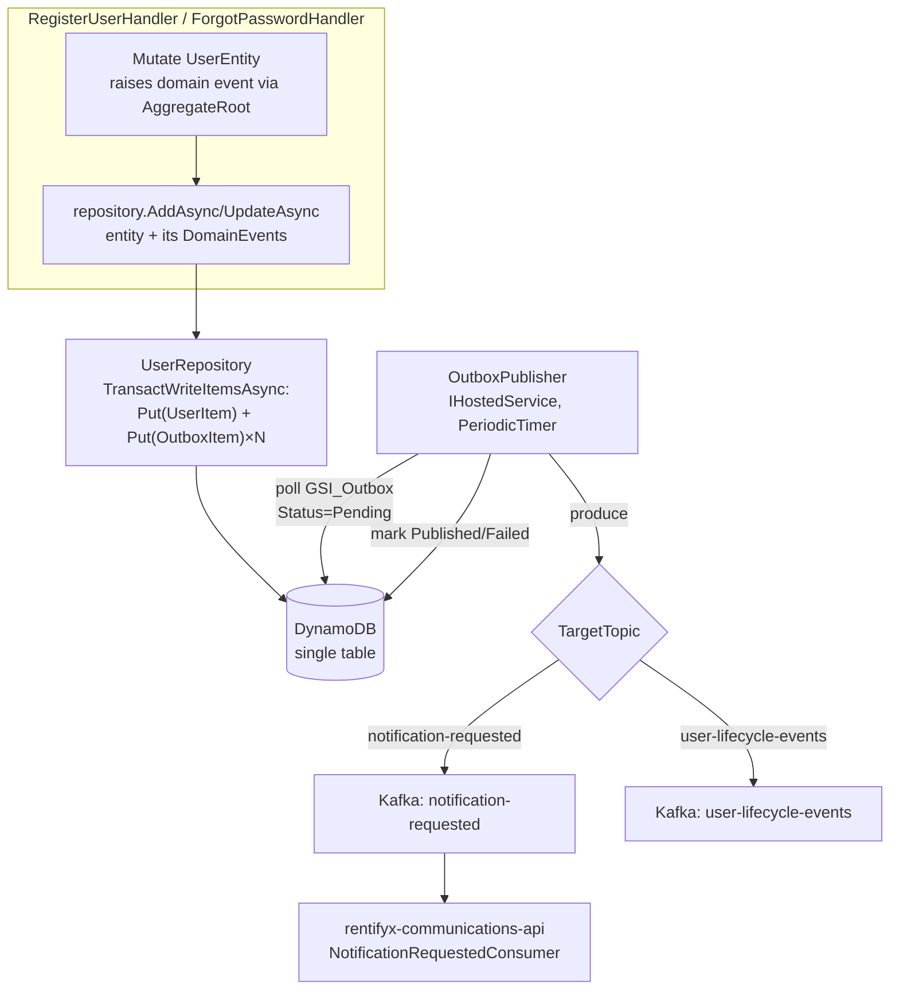

# Domain Event Outbox & Kafka Notification Producer — Design

**Spec**: `.specs/features/outbox-kafka-notifications/spec.md`
**Status**: Draft

---

## Research Findings (2026-07-15)

Confirmed by reading code directly (not assumed):

- **comms-api's wire contract** (`02-src/02-Application/RentifyxCommunications.Application/Features/Notifications/Handlers/Dispatch/Request/DispatchNotificationRequest.cs`):
  ```csharp
  public sealed record DispatchNotificationRequest(
      Guid CorrelationId,
      Guid RecipientId,
      string RecipientEmail,
      string Channel,
      string TemplateId,
      IReadOnlyDictionary<string, string> Payload);
  ```
  This is the exact shape this feature's producer must emit for `UserRegistered`/`PasswordResetRequested`.
- **Topic name**: `"notification-requested"` (`RentifyxCommunications.Domain.Constants.RetryTopicChain.OriginalTopic`).
- **Only one template exists on the comms-api side today: `welcome-email`** (resolved via embedded
  `.scriban` resource matching `{templateId}.scriban`). Neither an email-verification nor a
  password-reset template exists yet. **Cross-repo dependency, not built here**: comms-api needs
  two new `.scriban` files before R-05/R-06 will actually render anything — flagged again at Tasks
  time, this design cannot resolve it unilaterally.
- **`docs/contracts/notification-requested.md` does not exist** in comms-api (E-08 F-15 not done).
  This design relies on reading `DispatchNotificationRequest` directly instead.
- **`UserEntity`** (`02-src/03-Domain/RentifyxIdentity.Domain/Entities/UserEntity.cs`) is a
  `sealed class`, no base class, private parameterless constructor + `Create`/`Reconstitute`
  factories. **No domain-event collection exists on it today** — `RegisterUserHandler` builds a
  `UserRegistered` instance inline and only logs it (dead end).
- **`UserRepository`** (`IDynamoDBContext`-based, D-012) has **no atomic multi-item write
  capability** — `TransactWriteItemsAsync` is used nowhere in this codebase. `UpdateAsync` is
  literally `AddAsync` (single-item PUT). This is the real gap R-02 needs to close.
- **`Confluent.Kafka` is genuinely absent** from `Directory.Packages.props` — zero Kafka code
  exists anywhere in `02-src`/`03-tests` today.
- **Both handlers' `rawToken`** is `Guid.NewGuid().ToString()`, generated before the entity mutation,
  hashed via `ITokenService.HashToken()` for storage, and (today) passed unhashed to `IEmailService`.
  The Outbox payload needs this same unhashed `rawToken` — it must travel through the domain event.

---

## Architecture Overview



---

## Code Reuse Analysis

### Existing Components to Leverage

| Component | Location | How to Use |
|---|---|---|
| `UserRepository` (`IDynamoDBContext`) | `02-src/05-Infrastructure/.../Repositories/UserRepository.cs` | `AddAsync`/`UpdateAsync` extended to also write Outbox items — same file, new atomic-write path added alongside the existing single-item `SaveAsync` calls (kept for reads/deletes, which don't need atomicity) |
| `UserDynamoDbMapper` | same folder as `UserRepository` | Reused as-is for the user item half of the transaction; `IDynamoDBContext.ToDocument()` converts the mapped POCO to an `AttributeValue` map for the low-level `TransactWriteItemsAsync` call |
| `ITokenService.HashToken()` | `02-src/05-Infrastructure/.../Services/TokenService.cs` | Unchanged — still hashes the reset/verification token for storage; only the *unhashed* token now also flows into the domain event payload, nothing about hashing changes |
| comms-api's `IKafkaProducerFactory`/`KafkaProducerFactory` pattern (Infrastructure/Messaging, per that repo's F-09 layering correction) | reference only, not shared code (different repo/solution) | Same shape reproduced here: a factory that builds `IProducer<Null, string>`, not injected into Domain |
| `ReconciliationHostedService` pattern | reference only (comms-api F-09) | `OutboxPublisher` uses the same `PeriodicTimer`-driven poll shape, not DynamoDB Streams (simpler, matches R-03's "confirm at design time" — resolved here in favor of polling since Streams would need a Lambda/separate compute this repo doesn't have) |

### Integration Points

| System | Integration Method |
|---|---|
| DynamoDB (existing table) | New item type (`OUTBOX#{id}` / `OUTBOX#{id}`) in the same single-table design (D-003); new GSI (`GSI_Outbox`) for the publisher's poll query — **Terraform change required in this repo's own `iac/`, flagged as a Tasks-phase dependency, not designed here** |
| `rentifyx-platform`'s shared Kafka | Broker address read from `IConfiguration`, satisfied by SSM (`/rentifyx/platform/kafka/bootstrap-servers`) in prod or local Aspire Kafka resource in dev — per spec.md R-10 |
| `rentifyx-communications-api` | Wire contract only (`DispatchNotificationRequest` shape reproduced above) — no shared code, no project reference, just an agreed JSON shape over Kafka |

---

## Components

### `IDomainEvent` (marker interface)

- **Purpose**: Marks a type as a domain event.
- **Location**: `02-src/03-Domain/RentifyxIdentity.Domain/Events/IDomainEvent.cs`
- **Interfaces**: `interface IDomainEvent { DateTimeOffset OccurredAt { get; } }`
- **Dependencies**: none
- **Reuses**: n/a — new

### `AggregateRoot` (base class)

- **Purpose**: Accumulates raised domain events until explicitly cleared (by the repository, after
  the atomic write succeeds).
- **Location**: `02-src/03-Domain/RentifyxIdentity.Domain/Common/AggregateRoot.cs`
- **Interfaces**:
  - `protected void RaiseDomainEvent(IDomainEvent domainEvent)`
  - `IReadOnlyCollection<IDomainEvent> DomainEvents { get; }`
  - `void ClearDomainEvents()`
- **Dependencies**: `IDomainEvent`
- **Reuses**: n/a — new
- **SPEC_DEVIATION**: spec.md R-01 asked for `AggregateRoot<TId>` (generic). Built as plain
  `AggregateRoot` instead — `UserEntity` already owns and manages its own strongly-typed `Id`
  property (with a private setter and specific construction rules via `Create`/`Reconstitute`);
  threading a second `TId` through a generic base class would either duplicate that property or
  force a rename, for a codebase with exactly one aggregate. Revisit if a second aggregate is ever
  added and the duplication becomes real.

### `UserEntity` (modified, not rebuilt)

- **Purpose**: Same as today — user aggregate. Now also raises domain events from its mutation
  methods.
- **Location**: `02-src/03-Domain/RentifyxIdentity.Domain/Entities/UserEntity.cs` (existing file, modified)
- **Interfaces**: unchanged public API (per R-01's constraint) — `Create()`, `VerifyEmail()`,
  `ResetPassword()`, `Suspend()`, `Anonymize()`, etc. all keep their exact current signatures.
  Internally, each now calls `RaiseDomainEvent(new XxxEvent(...))`.
- **Dependencies**: `AggregateRoot` (new base class)
- **Reuses**: all existing logic — this is additive, not a rewrite

**Event-raising map** (which existing method raises which existing event record):

| Method | Event raised | Existing event record used |
|---|---|---|
| `Create()` | `UserRegistered` | already exists, reused as-is |
| `VerifyEmail()` | `UserEmailVerified` | already exists, reused as-is |
| `ResetPassword()` | `UserPasswordChanged` | already exists, reused as-is |
| `Suspend()` | `UserSuspended` | already exists, reused as-is |
| `Anonymize()` | `UserAccountDeleted` | already exists, reused as-is |
| (login handler, not `UserEntity`) | `UserLoggedIn` | already exists — raised from `LoginHandler` directly since login success isn't a `UserEntity` mutation method; needs its own `IOutboxWriter`-style call, not folded into the transactional write below (login doesn't call `UpdateAsync` on failure paths — confirm at Tasks time this doesn't change existing login latency/behavior) |

**New event** (does not exist today, needed for R-06):
```csharp
public sealed record PasswordResetRequested(
    Guid UserId,
    string Email,
    string RawToken,
    DateTimeOffset OccurredAt) : IDomainEvent;
```
Raised from `ForgotPasswordHandler` directly (mirrors `UserLoggedIn`'s pattern — not a `UserEntity`
mutation event, since `SetPasswordResetToken()` already exists as a mutation and renaming its
semantics to "this method requests a reset" would conflate two different concerns: token storage
vs. "notify the user" intent). **Raised by the handler, passed into the repository call alongside
the entity**, not accumulated on `UserEntity.DomainEvents` — see `IUserRepository` signature below.

### `IUserRepository` / `UserRepository` (extended, not replaced)

- **Purpose**: Same as today, plus atomic Outbox write.
- **Location**: `02-src/05-Infrastructure/RentifyxIdentity.Infrastructure/Repositories/UserRepository.cs`
- **Interfaces** (new overloads, existing ones untouched for callers that don't need outbox — e.g. `DeleteAsync`):
  - `Task AddAsync(UserEntity entity, IReadOnlyCollection<IDomainEvent> extraEvents, CancellationToken ct = default)` — writes the user item + `entity.DomainEvents` + `extraEvents` (for handler-raised events like `PasswordResetRequested`/`UserLoggedIn`) atomically via `TransactWriteItemsAsync`, then calls `entity.ClearDomainEvents()`
  - `Task UpdateAsync(UserEntity entity, IReadOnlyCollection<IDomainEvent> extraEvents, CancellationToken ct = default)` — same atomic path (no longer just a delegate to `AddAsync` under the hood — both build the same transaction shape, but semantically distinct calls, matching existing caller intent)
  - Existing `AddAsync(UserEntity, ct)` / `UpdateAsync(UserEntity, ct)` (no events) kept as thin overloads calling the new ones with an empty `extraEvents` list — **no existing call site that doesn't need outbox writes has to change**
- **Dependencies**: `IAmazonDynamoDB` (already in DI, currently only used to construct `IDynamoDBContext` — now also used directly for `TransactWriteItemsAsync`), `IOutboxEntryFactory` (new, see below)
- **Reuses**: `UserDynamoDbMapper.ToItem()`, `IDynamoDBContext.ToDocument()` (converts a mapped POCO to an `AttributeValue` map, needed since `TransactWriteItemsAsync` is a low-level `IAmazonDynamoDB` call, not `IDynamoDBContext`)

### `IOutboxEntryFactory` / `OutboxEntryFactory`

- **Purpose**: Maps a raised `IDomainEvent` into a persistable `OutboxEntry`, deciding its target
  Kafka topic and serialized payload shape.
- **Location**: `02-src/02-Application/RentifyxIdentity.Application/Outbox/OutboxEntryFactory.cs`
  (Application layer — it needs to know about `DispatchNotificationRequest`'s wire shape, which is
  an integration concern, not a pure Domain one)
- **Interfaces**: `IReadOnlyList<OutboxEntry> CreateEntries(IReadOnlyCollection<IDomainEvent> domainEvents)`
- **Dependencies**: none beyond the event types themselves
- **Reuses**: n/a — new

**Routing table** (per spec.md's broad-MVP decision — all 6 events get an Outbox entry, only 2 map
to comms-api's contract today):

| Domain event | Target topic | Serialized shape |
|---|---|---|
| `UserRegistered` | `notification-requested` | `DispatchNotificationRequest { CorrelationId = outboxEntryId, RecipientId = UserId, RecipientEmail = Email, Channel = "Email", TemplateId = "email-verification", Payload = { "token": RawToken } }` — **`RawToken` must be added to the existing `UserRegistered` record** (currently `Guid UserId, string Email, UserRole Role, DateTimeOffset OccurredAt` — no token field; this is a required, additive change to that record, confirm at Tasks time it doesn't break the (currently dead-end, log-only) existing usage) |
| `PasswordResetRequested` (new) | `notification-requested` | `DispatchNotificationRequest { ..., TemplateId = "password-reset", Payload = { "token": RawToken } }` |
| `UserEmailVerified`, `UserPasswordChanged`, `UserSuspended`, `UserAccountDeleted`, `UserLoggedIn` | `user-lifecycle-events` (new, generic topic — no consumer exists yet) | A generic envelope: `{ EventType: "UserSuspended", AggregateId: Guid, OccurredAt: DateTimeOffset, Data: <the record's own fields as JSON> }` — deliberately simple since nothing consumes this yet (spec.md Out of Scope) |

### `OutboxEntry` (Domain entity/value object + DynamoDB item)

- **Purpose**: Durable record of "this event must be published," survives process crashes between
  the transactional write and the publish.
- **Location**: `02-src/03-Domain/RentifyxIdentity.Domain/Entities/OutboxEntry.cs` (Domain shape) +
  `02-src/05-Infrastructure/.../DynamoDb/OutboxDynamoDbItem.cs` (persistence mapping, matches the
  existing `UserDynamoDbItem` split)
- **Interfaces**: `OutboxEntry(Guid Id, string TargetTopic, string MessageJson, OutboxStatus Status, DateTimeOffset CreatedAt, int RetryCount)` — `OutboxStatus` new enum: `Pending`, `Published`, `Failed` (stored as string per D-008)
- **Dependencies**: none
- **Reuses**: D-008's string-enum persistence convention, D-016's SK-equals-PK convention (`PK = SK = "OUTBOX#{Id}"`)

### `OutboxPublisher` (`IHostedService`)

- **Purpose**: Polls Pending Outbox entries, publishes to Kafka, marks Published/Failed.
- **Location**: `02-src/01-Api/RentifyxIdentity.Api/Messaging/OutboxPublisher.cs` (matches
  comms-api's convention of hosted services living in the Api project, e.g. its
  `NotificationRequestedConsumer`)
- **Interfaces**: `IHostedService` — `StartAsync`/`StopAsync`/internal `PeriodicTimer` poll loop
- **Dependencies**: `IOutboxRepository` (new, thin — `GetPendingAsync`/`MarkPublishedAsync`/`MarkFailedAsync` via the new `GSI_Outbox`), `IKafkaProducerFactory` (new)
- **Reuses**: comms-api's `ReconciliationHostedService` polling shape as a structural reference (not shared code)

### `IKafkaProducerFactory` / `KafkaProducerFactory`

- **Purpose**: Builds a configured `IProducer<Null, string>`.
- **Location**: `02-src/05-Infrastructure/RentifyxIdentity.Infrastructure/Messaging/KafkaProducerFactory.cs`
- **Interfaces**: `IProducer<Null, string> Create()`
- **Dependencies**: `IConfiguration` (broker address — spec.md R-10, never hardcoded)
- **Reuses**: comms-api's `IKafkaProducerFactory` shape as structural reference only — new package
  (`Confluent.Kafka`, currently absent from `Directory.Packages.props`, must be added at Tasks time)

---

## Data Models

### `OutboxEntry` (DynamoDB item, same table as `UserDynamoDbItem` per D-003)

```
PK: "OUTBOX#{Id}"
SK: "OUTBOX#{Id}"          (D-016 convention: SK equals PK for single-item access patterns)
TargetTopic: string
MessageJson: string         (the fully-serialized DispatchNotificationRequest or generic envelope)
Status: string               ("Pending" | "Published" | "Failed" — D-008)
CreatedAt: string             (ISO8601, GSI sort key)
RetryCount: number

GSI_Outbox:
  PK: "OUTBOX_STATUS#{Status}"
  SK: CreatedAt
```

**New GSI required** on the existing table — Terraform change in this repo's own `iac/` (out of
scope for this design doc, flagged as a Tasks-phase dependency).

**Relationships**: No foreign key to `UserEntity` beyond what's embedded in `MessageJson`
(`RecipientId`/`AggregateId`) — the Outbox item is fully self-contained once written, so the
publisher never needs to re-read the user item.

---

## Error Handling Strategy

| Error Scenario | Handling | User Impact |
|---|---|---|
| `TransactWriteItemsAsync` fails (e.g. condition check, throttling) | Whole transaction rolls back — neither the user item nor any Outbox entry is written. Handler's existing `ErrorOr<T>` failure path applies (matches D-001), same as any other repository failure today | Registration/reset request fails with an error response — no silent partial state, which is strictly better than today's separate-write risk |
| Kafka broker unreachable when `OutboxPublisher` tries to publish | Entry stays `Pending`, `RetryCount` increments, retried on next poll tick, up to R-04's 3-attempt cap | None immediately — user already got a success response from the original request (per outbox pattern's whole point: persistence success ≠ delivery success, decoupled) |
| `RetryCount` exceeds 3 | Entry marked `Failed`, logged at `Critical` (R-04) | User's verification/reset email never arrives; this is a silent failure from the user's perspective — **acceptable for this cycle per spec.md's Out of Scope on producer-side DLQ sophistication**, but worth flagging as a real UX gap for a future iteration (not this spec's problem to solve) |
| `UserRegistered`'s `RawToken` field addition breaks anything reading the old shape | Nothing currently deserializes `UserRegistered` from a persisted form (it was log-only) — this is a safe additive change, not a migration | None |

---

## Tech Decisions (only non-obvious ones)

| Decision | Choice | Rationale |
|---|---|---|
| Atomicity mechanism | `IAmazonDynamoDB.TransactWriteItemsAsync` (low-level), not `IDynamoDBContext` | Confirmed by reading `UserRepository.cs` directly: `IDynamoDBContext.SaveAsync` cannot span two items atomically, and `TransactWriteItemsAsync` is used nowhere in this codebase today — this is new capability, not a reuse. `IDynamoDBContext.ToDocument()` still reused for mapping so this isn't a wholesale reversal of D-012, just a necessary exception for this one atomic path |
| `AggregateRoot` genericity | Plain `AggregateRoot`, not `AggregateRoot<TId>` | See SPEC_DEVIATION note in Components — single-aggregate codebase, generic `TId` adds complexity with no current consumer |
| Outbox polling mechanism | `PeriodicTimer` poll (like comms-api's `ReconciliationHostedService`), not DynamoDB Streams | Streams would need a Lambda or separate compute process this repo doesn't have; a poll loop is simpler and consistent with the reference pattern already proven in the sibling repo |
| `PasswordResetRequested` and `UserLoggedIn` are raised by their handlers directly, not accumulated via `UserEntity.RaiseDomainEvent` | Handler-level event construction for events that aren't `UserEntity` mutations | `SetPasswordResetToken()`/successful login aren't state *mutations* that should implicitly carry a "notify" side effect baked into the entity — keeps `UserEntity`'s mutation methods honest about what they actually do |
| Two different message shapes on two different topics | `notification-requested` gets comms-api's exact `DispatchNotificationRequest` shape; everything else gets a generic envelope on `user-lifecycle-events` | Only `notification-requested` has a real, contract-bound consumer today (comms-api) — inventing a rigid contract for events with zero consumers would be speculative design; the generic envelope keeps that door open cheaply |

---

## Open Items for Tasks Phase

- **Cross-repo blocker, not resolvable here**: comms-api needs `email-verification` and
  `password-reset` `.scriban` templates before R-05/R-06 will actually render/send anything —
  surface this to the comms-api side before Tasks execution starts on this repo, ideally as a
  small comms-api quick-mode task, not blocking this repo's own Tasks phase from being written.
- New DynamoDB GSI (`GSI_Outbox`) needs a Terraform change in this repo's own `iac/` — a Tasks-phase
  task, not designed here (infra, not application code).
- `Confluent.Kafka` package needs adding to `Directory.Packages.props` — first Kafka dependency in
  this repo.
- Confirm exact SSM parameter path/consumption pattern against `rentifyx-platform`'s
  `shared-kafka-eks` feature (already built: `/rentifyx/platform/kafka/bootstrap-servers`) — this
  design assumed that exact path, confirm it hasn't changed since.
- `UserRegistered` record's new `RawToken` field — confirm no other reader of that record breaks
  (currently none exist, but re-verify at Tasks time, not assumed permanent).
