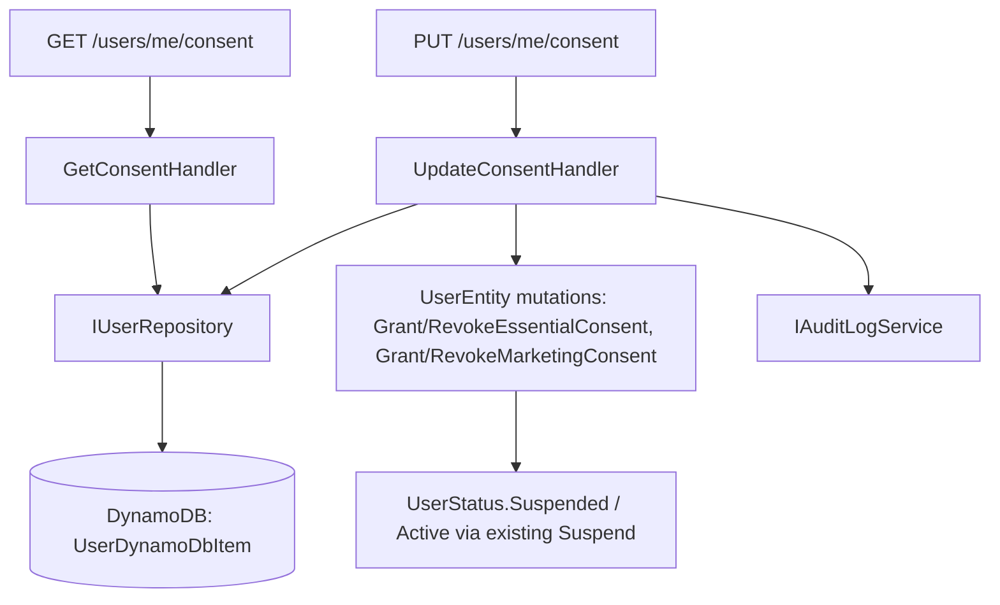

# LGPD Granular Consent (R-03) — Design

**Spec**: `.specs/features/post-assessment-hardening/spec.md` (R-03)
**Context**: `.specs/features/post-assessment-hardening/context.md`
**Status**: Draft

---

## Architecture Overview

Two new endpoints under the existing authenticated `Users` group, following the exact
`IEndpoint` + `IHandler<TRequest,TResponse>` + `ErrorOr<T>` pattern already used by
`GetProfile`/`DeleteAccount`/`ExportData`. No new architectural pattern — this is additive to
the existing User aggregate.



Cross-service notification to `rentifyx-communications-api` is explicitly **out of scope** for
this design — per `context.md`, that requires the Outbox pattern (DEF-005), which doesn't exist
yet. This feature only makes identity-api the correct, queryable source of truth; push
notification is a follow-up once DEF-005 ships.

---

## Code Reuse Analysis

### Existing Components to Leverage

| Component | Location | How to Use |
|---|---|---|
| `UserEntity.Suspend()` | `03-Domain/.../Entities/UserEntity.cs:101` | Called by `RevokeEssentialConsent()` — no change to this method itself |
| `UserStatus.Suspended` gating | `LoginHandler`, `RefreshTokenHandler`, `ResetPasswordHandler`, `VerifyEmailHandler` | Already blocks these flows for suspended accounts — revoking essential consent plugs in for free |
| `SetConsent(DateTimeOffset)` pattern | `UserEntity.cs:31` | Same shape reused for the four new mutation methods (set-a-timestamp style, no extra state machine) |
| `IAuditLogService.LogAsync(userId, eventType, ct)` | `Domain/Interfaces/Users/IAuditLogService.cs` | Reused as-is; four new `AuditEvents` constants added, no interface change |
| `GetProfile` endpoint/handler shape | `Api/Endpoints/Users/GetProfile.cs`, `Application/.../GetProfileHandler.cs` | Exact template for both new endpoints — `ClaimTypes.NameIdentifier` → `Guid userId`, `NotFound` on `Status is UserStatus.Deleted` |
| `UserDynamoDbMapper` | `Infrastructure/Mapping/UserDynamoDbMapper.cs` | Extended, not replaced — same `ToItem`/`ToEntity` pair |
| `ValidationMessageResource` + `UserErrorCodes` | `Domain/Constants/` | Extended with new entries, existing ones untouched |

### Integration Points

| System | Integration Method |
|---|---|
| DynamoDB (`UserDynamoDbItem`) | 3 new nullable string attributes added (see Data Models); existing `ConsentGivenAt` attribute reused as-is for Essential |
| Audit log (`AuditLogService`) | 4 new event-type string constants, same `LogAsync` call shape already used by every other handler |
| `rentifyx-communications-api` | **Not integrated in this design** — deferred until Outbox (DEF-005) exists (see Architecture Overview note) |

---

## Components

### `ConsentPurpose` (new enum)

- **Purpose**: Distinguishes Essential vs Marketing consent
- **Location**: `03-Domain/RentifyxIdentity.Domain/Enums/ConsentPurpose.cs`
- **Values**: `Essential`, `Marketing`
- **Reuses**: Same enum-as-string-in-DynamoDB convention as `UserRole`/`UserStatus` (D-008)

### `UserEntity` mutation methods (extended)

- **Purpose**: Grant/revoke consent per purpose, with Essential wired to account suspension
- **Location**: `03-Domain/RentifyxIdentity.Domain/Entities/UserEntity.cs`
- **Interfaces**:
  - `GrantEssentialConsent(DateTimeOffset now)` — sets `ConsentGivenAt = now`, clears
    `EssentialConsentRevokedAt`, sets `Status = UserStatus.Active`
  - `RevokeEssentialConsent(DateTimeOffset now)` — clears `ConsentGivenAt`, sets
    `EssentialConsentRevokedAt = now`, calls existing `Suspend()`
  - `GrantMarketingConsent(DateTimeOffset now)` — sets `MarketingConsentGivenAt = now`, clears
    `MarketingConsentRevokedAt`
  - `RevokeMarketingConsent(DateTimeOffset now)` — clears `MarketingConsentGivenAt`, sets
    `MarketingConsentRevokedAt = now`
  - Read-only: `IsEssentialConsentGranted => ConsentGivenAt.HasValue`,
    `IsMarketingConsentGranted => MarketingConsentGivenAt.HasValue`
- **Dependencies**: none new
- **Reuses**: `Suspend()` unchanged; same "current value present = granted" convention avoids any
  timestamp-comparison logic

### `GetConsentHandler` / `UpdateConsentHandler`

- **Purpose**: Return current consent state; apply a grant/revoke mutation
- **Location**: `02-Application/RentifyxIdentity.Application/Features/Identity/User/Consent/`
- **Interfaces**: `IHandler<GetConsentRequest, ConsentResponse>`,
  `IHandler<UpdateConsentRequest, ConsentResponse>`
- **Dependencies**: `IUserRepository`, `IAuditLogService`, `IValidator<UpdateConsentRequest>`
- **Reuses**: exact handler shape of `GetProfileHandler`/`DeleteAccountHandler` (NotFound check
  on `Status is UserStatus.Deleted`, try/catch-and-log-only around the audit call — audit
  failures never fail the request, matching the existing pattern in `GetProfileHandler.cs:38-45`)

### `GetConsent` / `UpdateConsent` endpoints

- **Purpose**: HTTP surface
- **Location**: `01-Api/RentifyxIdentity.Api/Endpoints/Users/GetConsent.cs`, `UpdateConsent.cs`
- **Interfaces**: `GET /users/me/consent` → 200 `ConsentResponse`; `PUT /users/me/consent` → 200
  `ConsentResponse`
- **Reuses**: identical `ClaimTypes.NameIdentifier` extraction + `result.Match(...)` pattern as
  `GetProfile.cs`

---

## Data Models

### `UserEntity` (additions only)

```
DateTimeOffset? ConsentGivenAt              // EXISTING — now semantically "Essential granted at"
DateTimeOffset? EssentialConsentRevokedAt   // NEW
DateTimeOffset? MarketingConsentGivenAt     // NEW
DateTimeOffset? MarketingConsentRevokedAt   // NEW
```

No rename of `ConsentGivenAt` — avoids touching every existing call site
(`RegisterUserHandler`, `UserMapper`, `UserDynamoDbMapper`, all consent-related tests) for a
purely cosmetic gain. The property continues to mean "Essential consent granted at."

### `UserDynamoDbItem` (additions only)

```csharp
public string? EssentialConsentRevokedAt { get; set; }
public string? MarketingConsentGivenAt { get; set; }
public string? MarketingConsentRevokedAt { get; set; }
```

Existing `ConsentGivenAt` attribute untouched. All three new attributes are absent on existing
items — the AWS SDK maps a missing attribute to `null`, which naturally satisfies the
already-agreed default (R-07-style: existing users start with Marketing not granted, no
migration script needed).

### `ConsentResponse` (new, Application layer)

```csharp
public sealed record ConsentResponse(
    bool EssentialGranted,
    DateTimeOffset? EssentialGrantedAt,
    DateTimeOffset? EssentialRevokedAt,
    bool MarketingGranted,
    DateTimeOffset? MarketingGrantedAt,
    DateTimeOffset? MarketingRevokedAt);
```

### `UpdateConsentRequest` (new, Application layer)

```csharp
public sealed record UpdateConsentRequest(Guid UserId, string Purpose, bool Granted);
```

`Purpose` is a string at the request boundary (matches existing convention — `RegisterUserRequest.Role`
is also a string, parsed/validated rather than bound as an enum) validated against
`ConsentPurpose` names by `UpdateConsentValidator`.

**Relationships**: Both new request types carry `UserId` sourced from the JWT
`ClaimTypes.NameIdentifier` claim at the endpoint layer, identical to `GetProfileRequest`.

---

## Error Handling Strategy

| Error Scenario | Handling | User Impact |
|---|---|---|
| User not found / already `Deleted` | `Error.NotFound(UserErrorCodes.NotFound, ...)` | 404, same as `GetProfile` |
| Invalid `Purpose` string (not "Essential"/"Marketing") | FluentValidation rule fails | 400 with validation error |
| Revoke a purpose that's already revoked | No-op success — mutation methods are idempotent by construction (setting already-null fields to null/already-set timestamp is harmless) | 200, same `ConsentResponse` reflecting current (unchanged) state |
| Grant Essential consent while already `Active` (not suspended) | Still executes — `Status = UserStatus.Active` is a no-op if already Active | 200, no behavior change |
| Concurrent grant/revoke race (two requests in flight) | Not specially handled — matches the rest of the codebase, which has no optimistic concurrency control anywhere today | Last write wins, consistent with existing `UpdateAsync` behavior elsewhere |

---

## Tech Decisions (only non-obvious ones)

| Decision | Choice | Rationale |
|---|---|---|
| Keep `ConsentGivenAt` name, don't rename to `EssentialConsentGivenAt` | Add new fields only | Avoids a mechanical rename touching 6+ files for no functional gain; the field's meaning is documented here and in code via XML doc if needed |
| "Granted" derived from presence, not a separate bool + timestamp pair | `GivenAt.HasValue` | Matches the existing `SetConsent` pattern exactly; avoids two sources of truth that could disagree |
| Single `UpdateConsentRequest(Purpose, Granted)` endpoint instead of 4 separate endpoints (grant-essential, revoke-essential, grant-marketing, revoke-marketing) | One `PUT` endpoint | Fewer endpoints to maintain/test; `Purpose`+`Granted` is a small, clear payload — consistent with keeping the API surface minimal |
| No event/Outbox dispatch to `rentifyx-communications-api` in this design | Deferred | Confirmed in `context.md` — full cross-service notification depends on DEF-005 (Outbox), which doesn't exist. This feature ships the correct data model and API now; wiring the notification is a distinct follow-up once Outbox lands |
| Reactivation on Essential re-grant sets `Status = Active` unconditionally | Accepted for MVP | No other feature suspends an account today (`Suspend()` currently has no other caller) — if a future admin-suspend capability is added, this will need a `SuspensionReason` to avoid incorrectly reactivating an admin-suspended account. Noted as a known future edge case, not a blocker now. |

---

## Open follow-ups for Tasks phase

- Coordinate with `pf-pj-customer-support` T-05 (`GetProfile`/`ExportData` response changes) —
  both touch the same response/mapper files; sequence to avoid merge conflicts.
- `ExportData` response should be extended to include the two new Marketing fields alongside the
  existing `ConsentGivenAt` (DEF-006 already put consent in the export — this just completes it
  for the new purpose).
