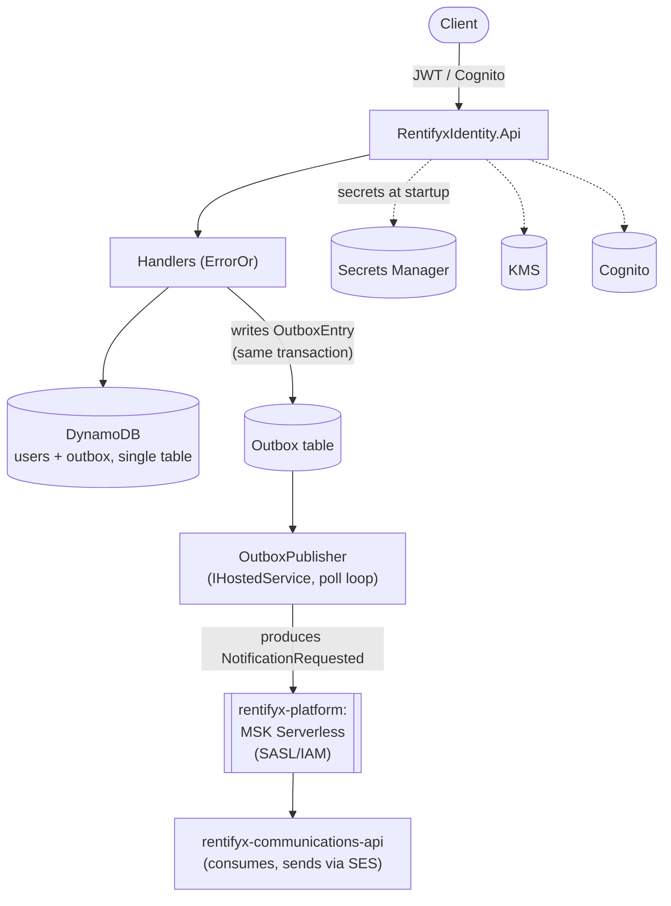

# RentifyX Identity API

[](https://github.com/eugeniobandeira/rentifyx-identity-api/actions/workflows/ci.yml)

[](LICENSE)
[](https://linkedin.com/in/eugeniobandeira)

Production-grade Identity microservice for the RentifyX platform. Built with .NET 10 Minimal APIs, Clean Architecture, DDD, and TDD.

Covers user registration, email verification, login, token refresh, logout, password reset, and LGPD compliance (data access, erasure, export, granular per-purpose consent, audit).

## Why this service exists

Every other RentifyX service needs to know "who is this user" and "what have they consented to"
without re-implementing auth, password handling, or LGPD bookkeeping themselves. This service owns
that once: it is the single source of truth for identity and consent, issues the JWTs every other
service trusts, and — instead of calling out to email infrastructure synchronously on the request
path — writes to a transactional Outbox table and lets a background publisher deliver events to
Kafka on its own schedule. That decouples "did the user's request succeed" from "did the email
provider respond in time."

## Architecture



Publishing is decoupled from the request path via the Outbox pattern (`OutboxRepository` +
`OutboxPublisher`): a handler that needs to notify a user (e.g. after registration) writes an
`OutboxEntry` row alongside its own DynamoDB write, and `OutboxPublisher` — a `PeriodicTimer`-driven
`IHostedService` — polls for `Pending` entries, produces them to Kafka, and marks them `Published`
on ack (retrying up to `MaxRetryCount` times, then marking `Failed` and logging Critical). This
mirrors `rentifyx-communications-api`'s own reconciliation loop shape rather than relying on
DynamoDB Streams.

In production, `KafkaProducerFactory` authenticates to MSK Serverless via SASL/IAM
(`AWS.MSK.Auth`) — no Kafka credentials are stored anywhere; the EC2 instance's own IAM role signs
each token. Locally/in tests, it falls back to a plaintext producer against the Aspire-managed
Kafka container. The MSK cluster itself, along with the IAM policy this service's EC2 role needs to
publish to it, lives in [`rentifyx-platform`](https://github.com/eugeniobandeira/rentifyx-platform)
and is consumed here via `terraform_remote_state` (see `iac/terraform/main.tf`).

## Tech Stack

| Concern | Library / Technology |
|---|---|
| Framework | ASP.NET Core 10 Minimal APIs |
| Architecture | Clean Architecture · DDD · TDD |
| Error Handling | ErrorOr 2.0.1 |
| Validation | FluentValidation 12.1.1 |
| Logging | Serilog 10.0.0 |
| API Versioning | Asp.Versioning.Http 8.1.0 |
| API Documentation | Scalar + Microsoft.AspNetCore.OpenApi |
| Orchestration | .NET Aspire 9.3.1 |
| Observability | OpenTelemetry (traces, metrics, logs) |
| Auth | JWT RS256 · AWS Cognito |
| Database | AWS DynamoDB (single-table design) |
| Email | AWS SES v2 |
| Secrets | AWS Secrets Manager |
| Encryption | AWS KMS |
| Event publishing | Apache Kafka (Confluent.Kafka) — Outbox pattern, `IHostedService` publisher, SASL/IAM auth against MSK Serverless in production (`AWS.MSK.Auth`) |
| Repository Test Cloud | LocalStack via Testcontainers (integration tests only — the API itself targets real AWS, including locally) |
| Testing | xUnit · Moq · FluentAssertions · Bogus · Testcontainers |
| Code Analysis | SonarAnalyzer.CSharp |
| Security | OWASP Top 10 · gitleaks · Trivy |
| Compliance | LGPD · BACEN |

## Flows

Full request/response schemas, validation rules, and status codes for every endpoint below are
in [`docs/api-contracts.md`](docs/api-contracts.md).

### Auth — `/api/v1/auth/*`
```
register → verify-email → login → refresh (every 15 min) → logout
                                 ↘ forgot-password → reset-password
```
- `POST /auth/register` — create account (requires `consentGiven: true` for Essential consent)
- `POST /auth/verify-email` — activate the account with the emailed token
- `POST /auth/login` — returns an access token in the body; sets the refresh token as an
  `httpOnly` cookie (never exposed to JavaScript, scoped to `/api/v1/auth`)
- `POST /auth/refresh` — rotates the refresh token (reads it from the cookie, not the body)
- `POST /auth/logout` — revokes the refresh token and clears the cookie (idempotent)
- `POST /auth/forgot-password` / `POST /auth/reset-password` — email-token-based password reset

### Users (LGPD) — `/api/v1/users/me*` (all require `Authorization: Bearer {accessToken}`)
- `GET /users/me` — profile (Art. 18)
- `DELETE /users/me` — soft-delete + PII anonymization (Art. 18 VI)
- `GET /users/me/data-export` — full personal-data export, including audit history (Art. 18 IV)
- `GET /users/me/consent` — current consent state per purpose (Essential, Marketing)
- `PUT /users/me/consent` — grant or revoke consent for one purpose. Revoking **Essential**
  suspends the account (blocks login/refresh/reset-password/verify-email until re-granted);
  revoking **Marketing** has no account effect. Revoking never deletes data — that stays
  exclusive to `DELETE /users/me`.

## Prerequisites

- [.NET 10 SDK](https://dotnet.microsoft.com/download/dotnet/10.0)
- [Docker](https://www.docker.com/) (required for repository integration tests, which use LocalStack via Testcontainers)
- AWS credentials with access to a real AWS account/region (`AWS_PROFILE` or `AWS_ACCESS_KEY_ID`/`AWS_SECRET_ACCESS_KEY`) — the API talks to real AWS even for local development, there is no LocalStack fallback
- .NET Aspire workload:

```bash
dotnet workload install aspire
```

## Running Locally

Provision the AWS resources first (see `iac/terraform`), then start the API with Aspire
orchestration (recommended — includes dashboard and Scalar UI):

```bash
cd iac/terraform
terraform init \
  -backend-config="bucket=rentifyx-tfstate-166613156216" \
  -backend-config="key=identity-api/terraform.tfstate" \
  -backend-config="region=us-east-1" \
  -backend-config="dynamodb_table=rentifyx-tflock"
terraform apply -var="environment=development" -var="ses_identity=you@example.com"
dotnet run --project 01-aspire/01-AppHost/RentifyxIdentity.AppHost
```

Or directly without Aspire:

```bash
dotnet run --project 02-src/01-Api/RentifyxIdentity.Api
```

Destroy the resources when done testing:

```bash
cd iac/terraform && terraform destroy -var="environment=development" -var="ses_identity=you@example.com"
```

Destroy this repo and `rentifyx-communications-api` **before** destroying `rentifyx-platform` —
both read its outputs (MSK client policy, shared SES identity) via `terraform_remote_state`.

## Running Tests

```bash
# All tests
dotnet test RentifyxIdentity.slnx

# Skip Docker-dependent tests
dotnet test RentifyxIdentity.slnx --filter "Category!=RequiresDocker"
```

## Running with Docker

```bash
docker build -t rentifyx-identity .
docker run -p 8080:8080 -e ASPNETCORE_ENVIRONMENT=Production rentifyx-identity
```

## Running on Kubernetes

```bash
kubectl apply -k k8s/overlays/dev
kubectl apply -k k8s/overlays/prod
```

## Project Structure

```
01-aspire/
  01-AppHost/             – .NET Aspire orchestration (starts API against real AWS)
  02-ServiceDefaults/     – OTel traces/metrics, health checks, service discovery
02-src/
  01-Api/                 – Minimal API endpoints, middlewares, extensions
  02-Application/         – Use cases via IHandler<TRequest,TResponse>, FluentValidation validators
  03-Domain/              – Entities, value objects, domain events, repository contracts
  04-IoC/                 – DI wiring (ApplicationDependencyInjection, InfrastructureDependencyInjection)
  05-Infrastructure/      – Repository implementations, AWS SDK adapters
03-tests/
  01-Common/              – Shared builders (Bogus)
  02-Validators/          – FluentValidation unit tests
  03-Handlers/            – Handler unit tests (Moq)
  04-Repositories/        – Repository integration tests (Testcontainers + LocalStack)
  05-Integration/         – End-to-end via CustomWebApplicationFactory
docs/
  architecture/           – Architecture overview and C4 diagrams
  decisions/              – ADRs (ADR-001 to ADR-008)
  guides/                 – adding-a-new-feature.md
iac/                      – Terraform modules
k8s/                      – Kustomize base + dev/prod overlays
```

## Architecture

### Layer responsibilities

| Layer | Responsibility | Allowed dependencies |
|---|---|---|
| Domain | Entities, value objects, domain events, repository interfaces | None |
| Application | Handlers, validators, DTOs, mappers | Domain |
| Infrastructure | Repository implementations, AWS SDK adapters | Domain |
| IoC | DI registration | All layers |
| Api | Endpoints, middlewares, HTTP mapping | Application, Domain |

### Dependency flow

```
Api → Application → Domain ← Infrastructure
                       ↑
              IoC (wires all layers)
```

- **Domain** has zero outbound dependencies and zero AWS/framework references.
- **Infrastructure** implements Domain interfaces. It never references Application.
- **Application** depends only on Domain interfaces, never on Infrastructure directly.
- **IoC** is the only layer that references all others — it is the composition root.

### Handler pattern

Every use case implements `IHandler<TRequest, TResponse>`, returning `ErrorOr<T>` instead of throwing exceptions:

```csharp
public interface IHandler<TRequest, TResponse>
{
    Task<ErrorOr<TResponse>> HandleAsync(TRequest request, CancellationToken cancellationToken = default);
}
```

Handlers and validators are registered explicitly in `ApplicationDependencyInjection` (one
`AddScoped<IHandler<...>>`/`AddScoped<IValidator<...>>` line per feature) — only API endpoints
are auto-discovered via reflection (see below).

### DynamoDB single-table design

All user data is stored in a single DynamoDB table using the following key schema:

| Key | Pattern | Purpose |
|---|---|---|
| PK (hash) | `USER#{id}` | Primary access by user ID |
| SK (range) | `USER#{id}` | Composite key (equals PK for user items) |
| GSI_Email | `EMAIL#{email}` | Lookup by email address |
| GSI_TaxId | `TAXID#{taxId}` | Lookup by CPF/CNPJ |

Unverified accounts have a DynamoDB TTL set to 48h — they are automatically deleted if the user never verifies their email.

### Endpoint pattern

```csharp
internal sealed class MyAction : IEndpoint
{
    public void MapEndpoint(IEndpointRouteBuilder app)
    {
        app.MapPost("/resource", HandleAsync)
           .WithName("...").WithTags(Tags.XXX);
    }

    private static async Task<IResult> HandleAsync(
        MyRequest request,
        IHandler<MyRequest, MyResponse> handler,
        HttpContext httpContext,
        CancellationToken cancellationToken = default)
    {
        var result = await handler.HandleAsync(request, cancellationToken);
        return result.Match(r => Results.Ok(r), e => e.ToProblem(httpContext));
    }
}
```

All endpoints are discovered and registered automatically via reflection — no manual wiring needed.

## Adding a New Feature

See [`docs/guides/adding-a-new-feature.md`](docs/guides/adding-a-new-feature.md) for the full
7-step process (Domain → Contracts → Application → Infrastructure → IoC → Api → Tests), with real
file-path examples from the `register-user` and consent features.

Note: validators and handlers are registered **explicitly** in `ApplicationDependencyInjection`/
`InfrastructureDependencyInjection` (one line per feature), not auto-discovered via reflection —
only API *endpoints* are reflection-discovered.

## Error Handling

Business logic never throws — it returns `ErrorOr<T>`. Endpoints map the result to HTTP responses:

```csharp
var result = await handler.HandleAsync(request, cancellationToken);
return result.Match(r => Results.Ok(r), e => e.ToProblem(httpContext));
```

| ErrorOr type | HTTP status |
|---|---|
| `Error.Validation` | 422 Unprocessable Entity |
| `Error.NotFound` | 404 Not Found |
| `Error.Conflict` | 409 Conflict |
| `Error.Unauthorized` | 401 Unauthorized |
| Other | 500 Internal Server Error |

## Middlewares

### CorrelationIdMiddleware

Reads `X-Correlation-Id` from the request header (generates a new `Guid` if absent), sanitizes it, pushes it to Serilog's `LogContext`, and echoes it in the response header.

### GlobalExceptionHandler

Catches all unhandled exceptions and returns a structured RFC 7807 `ProblemDetails` response — no stack traces exposed. `OperationCanceledException` from client disconnection returns HTTP 499.

### Rate Limiting

Fixed window policy applied globally to all versioned endpoints. Configurable via `appsettings.json`:

```json
"RateLimit": {
  "PermitLimit": 100,
  "WindowSeconds": 60,
  "QueueLimit": 0
}
```

## Health Endpoints

| Route | Purpose |
|---|---|
| `GET /health` | All registered health checks |
| `GET /alive` | Liveness probe |
| `GET /api/v1/health` | Application-level health check |

## Observability

OpenTelemetry is pre-configured for traces, metrics, and logs via .NET Aspire ServiceDefaults.

| Variable | Description |
|---|---|
| `OTEL_EXPORTER_OTLP_ENDPOINT` | Collector URL (empty = export disabled) |
| `OTEL_EXPORTER_OTLP_PROTOCOL` | `http/protobuf` or `grpc` |
| `OTEL_SERVICE_NAME` | Service name in traces/metrics |

## Security

- Secrets are never hardcoded — all sensitive config comes from AWS Secrets Manager.
- **Known gap**: TaxId (CPF/CNPJ) is currently stored as **plaintext** in DynamoDB. KMS encryption + HMAC blind index for lookup is deferred (see `.specs/project/STATE.md`, D-010/DEF-007).
- Refresh tokens are stored as HMAC-SHA256 hashes (not plaintext), with DynamoDB TTL.
- Rate limiting is applied at the route group level (OWASP A04).
- gitleaks runs as a pre-commit hook to prevent secret leaks.

## Centralized Package Management

All NuGet versions are declared in `Directory.Packages.props`. Individual `.csproj` files reference packages without specifying versions.

`Directory.Build.props` enforces `Nullable=enable`, `TreatWarningsAsErrors=true`, `LangVersion=latest`, and SonarAnalyzer.CSharp across every project.

## License

MIT © eugeniobandeira
