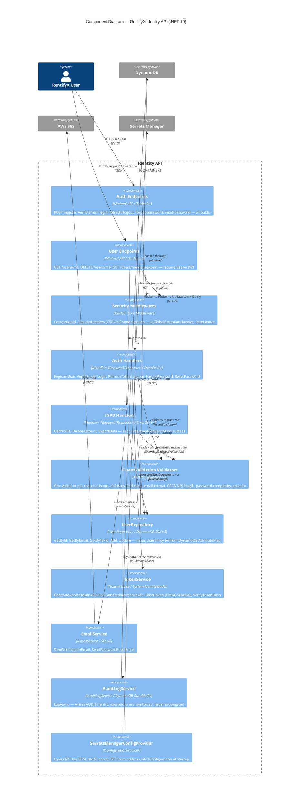

# C4 Level 3 — Component

Shows the internal components of the Identity API container and their relationships.



## Layer Dependency Direction

```
Api  ──▶  Application  ──▶  Domain  ◀──  Infrastructure
```

- **Domain** has no framework dependencies — entities, value objects, interfaces, constants only.
- **Application** depends on Domain interfaces; never on Infrastructure directly.
- **Infrastructure** implements Domain interfaces; never referenced by Application.
- **Api** wires everything via IoC and routes requests through handlers.

## Key Patterns

| Pattern | Where applied |
|---|---|
| `IHandler<TRequest, TResponse>` returning `ErrorOr<T>` | All use-case handlers |
| Static factory `Create(...)`, private setters | `UserEntity` and all value objects |
| Validator injected into handler constructor | Each handler validates its own request |
| Fire-and-forget audit (exception swallowed) | `GetProfileHandler`, `ExportDataHandler`, `DeleteAccountHandler` |
| Fake services in `CustomWebApplicationFactory` | `FakeTokenService`, `FakeEmailService`, `FakeAuditLogService` |
