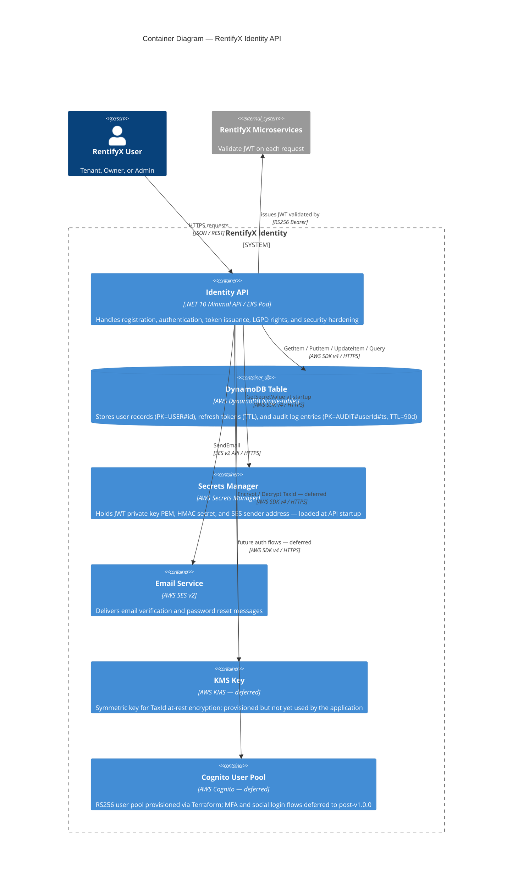

# C4 Level 2 — Container

Shows the deployable units that make up the RentifyX Identity system and how they communicate.

## Data Model — DynamoDB Single-Table

| Item type | PK | SK | Notes |
|---|---|---|---|
| User | `USER#<id>` | `USER#<id>` | All user attributes; GSI on `Email` and `TaxId` |
| Refresh token | `REFRESH#<hash>` | `REFRESH#<hash>` | TTL set on creation (sliding window) |
| Audit log entry | `AUDIT#<userId>#<yyyyMMddHHmmss>_<guid>` | same as PK | TTL = 90 days from creation |
