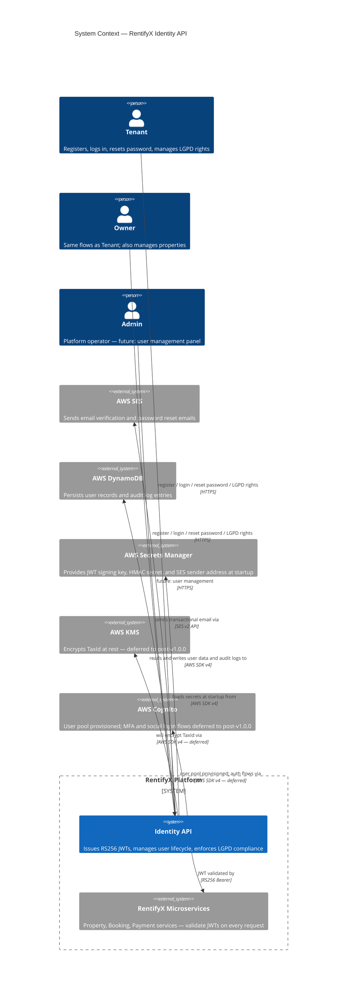

# C4 Level 1 — System Context

Shows who uses the RentifyX Identity API and which external systems it depends on.

```mermaid
C4Context
    title System Context — RentifyX Identity API

    Person(tenant, "Tenant", "Registers, logs in, resets password, manages LGPD rights")
    Person(owner, "Owner", "Same flows as Tenant; also manages properties")
    Person(admin, "Admin", "Platform operator — future: user management panel")

    System_Boundary(rentifyx, "RentifyX Platform") {
        System(identity, "Identity API", "Issues RS256 JWTs, manages user lifecycle, enforces LGPD compliance")
        System_Ext(platform, "RentifyX Microservices", "Property, Booking, Payment services — validate JWTs on every request")
    }

    System_Ext(ses, "AWS SES", "Sends email verification and password reset emails")
    System_Ext(dynamo, "AWS DynamoDB", "Persists user records and audit log entries")
    System_Ext(secrets, "AWS Secrets Manager", "Provides JWT signing key, HMAC secret, and SES sender address at startup")
    System_Ext(kms, "AWS KMS", "Encrypts TaxId at rest — deferred to post-v1.0.0")
    System_Ext(cognito, "AWS Cognito", "User pool provisioned; MFA and social login flows deferred to post-v1.0.0")

    Rel(tenant, identity, "register / login / reset password / LGPD rights", "HTTPS")
    Rel(owner, identity, "register / login / reset password / LGPD rights", "HTTPS")
    Rel(admin, identity, "future: user management", "HTTPS")
    Rel(identity, platform, "JWT validated by", "RS256 Bearer")
    Rel(identity, ses, "sends transactional email via", "SES v2 API")
    Rel(identity, dynamo, "reads and writes user data and audit logs to", "AWS SDK v4")
    Rel(identity, secrets, "loads secrets at startup from", "AWS SDK v4")
    Rel(identity, kms, "will encrypt TaxId via", "AWS SDK v4 — deferred")
    Rel(identity, cognito, "user pool provisioned; auth flows via", "AWS SDK v4 — deferred")

    UpdateLayoutConfig($c4ShapeInRow="3", $c4BoundaryInRow="1")
```
